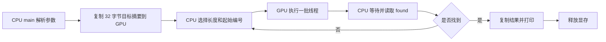

# 从零开始读懂这个 CUDA 项目

本文面向第一次接触 CUDA 的读者。我们从“程序究竟在做什么”开始，逐步走到线程组织、显存管理、SHA-256 内部实现、代码缺陷和实验方法。

讲解依据是本地仓库的提交 `08a8d7f786e6e458a5bc94508336c7492c83a647`。源码行号均指这份原始版本；后续修改后，行号会变化。仓库地址是 [happyeverydaybest-eng/sha256-bruteforce-cuda](https://github.com/happyeverydaybest-eng/sha256-bruteforce-cuda)。本文只新增学习文档，原来的三个源文件保持原样。

建议分几次读：第一次读第 1～7 节，理解整体；第二次读第 8～13 节，对照源码；第三次完成第 14～18 节的实验。不必第一次就记住 SHA-256 的全部公式。

## 目录

1. [这个项目解决什么问题](#1-这个项目解决什么问题)
2. [先补齐读代码需要的基础](#2-先补齐读代码需要的基础)
3. [认识仓库里的四个文件](#3-认识仓库里的四个文件)
4. [先理解 CPU 版](#4-先理解-cpu-版)
5. [候选密码如何从一个整数变出来](#5-候选密码如何从一个整数变出来)
6. [CUDA 从哪里开始](#6-cuda-从哪里开始)
7. [线程块网格和线程编号](#7-线程块网格和线程编号)
8. [跟着 CUDA 主函数走一遍](#8-跟着-cuda-主函数走一遍)
9. [跟着一个 GPU 线程走一遍](#9-跟着一个-gpu-线程走一遍)
10. [变量到底放在哪里](#10-变量到底放在哪里)
11. [读透 SHA-256 头文件](#11-读透-sha-256-头文件)
12. [用 abc 串起整个执行过程](#12-用-abc-串起整个执行过程)
13. [原项目有哪些问题](#13-原项目有哪些问题)
14. [在你的 Windows 电脑上准备环境](#14-在你的-windows-电脑上准备环境)
15. [先运行一个最小 CUDA 程序](#15-先运行一个最小-cuda-程序)
16. [一份可以对照原版的学习改写](#16-一份可以对照原版的学习改写)
17. [一步一步做实验](#17-一步一步做实验)
18. [如何正确讨论性能](#18-如何正确讨论性能)
19. [你应该能独立回答的问题](#19-你应该能独立回答的问题)
20. [接下来学什么](#20-接下来学什么)

## 1. 这个项目解决什么问题

### 1.1 输入、输出和中间过程

你交给程序一个 SHA-256 摘要，例如：

```text
ba7816bf8f01cfea414140de5dae2223b00361a396177a9cb410ff61f20015ad
```

这个值是 ASCII 字符串 `abc` 的 SHA-256，输入里没有换行。

程序不知道原文是什么。它生成候选字符串，逐个计算 SHA-256，比较结果。如果某个候选的摘要等于输入，就输出：

```text
Password found: abc
```

它的逻辑可以写成：

```text
目标摘要 H
    ↓
枚举候选字符串 p
    ↓
计算 SHA256(p)
    ↓
等于 H？——是→ 输出 p
    ↓ 否
尝试下一个候选
```

这叫穷举搜索，英文常写作 brute force。本项目采用的搜索范围很明确：

- 字符只来自 `abcdefghijklmnopqrstuvwxyz0123456789`，共 36 种。
- 字符串长度依次从 1 到 10。
- 不搜索空字符串、大写字母、空格、标点和中文。
- 每个候选直接做一次 SHA-256，没有盐值，也没有多次迭代。

因此，输入如果是 `A`、`hello!` 或空字符串的摘要，原程序不会在这个范围内找到它。找到的严格含义是“找到了一个具有该摘要的候选字符串”；摘要本身无法证明它就是外部系统当初使用的原文。

### 1.2 SHA-256 的三个长度不要混淆

| 对象 | 长度 | 在项目中的表示 |
|---|---:|---|
| 候选字符串 | 1～10 字节 | `password` |
| SHA-256 二进制摘要 | 32 字节，即 256 位 | `uint8_t hash[32]` |
| 摘要的十六进制文本 | 64 个字符 | 命令行参数 `argv[1]` |

一个字节有 8 位，十六进制的一个字符表示 4 位，因此一个字节需要两个十六进制字符。例如文本 `ba` 代表一个字节 `0xBA`。

SHA-256 还用到 **64 字节的输入分组**。这是算法处理输入的单位，与 32 字节的输出摘要是两件事。项目头文件中的 `SHA256_BLOCK_SIZE` 被定义成 32，其注释说的是摘要长度；名字容易误导，不能据此认为 SHA-256 的输入分组只有 32 字节。

SHA-256 的正式定义见 [NIST FIPS 180-4](https://csrc.nist.gov/pubs/fips/180-4/upd1/final)。下面的内部实现讲解会直接对应本仓库的 `sha256.cuh`。

### 1.3 为什么不能直接“反算”

普通加法 `x + 3 = 8` 可以解出 `x = 5`。SHA-256 没有对应的通用解密函数。本项目通过限制候选空间，把问题转化为“试这些字符串，哪个能匹配”。

GPU 加速的是尝试候选的过程。候选空间每增加一个字符，就扩大 36 倍。并行计算能提高尝试速度，指数增长仍然存在。

### 1.4 搜索空间究竟有多大

固定长度为 `L` 时，有 `36^L` 个候选。源码会先穷尽较短长度，再进入下一长度。

| 长度 L | 当前长度候选数 | 原配置下需要的批数，假设没有提前找到 |
|---:|---:|---:|
| 1 | 36 | 1 |
| 2 | 1,296 | 1 |
| 3 | 46,656 | 1 |
| 4 | 1,679,616 | 13 |
| 5 | 60,466,176 | 462 |
| 6 | 2,176,782,336 | 16,608 |
| 7 | 78,364,164,096 | 597,872 |
| 8 | 2,821,109,907,456 | 21,523,361 |
| 9 | 101,559,956,668,416 | 774,840,978 |
| 10 | 3,656,158,440,062,976 | 27,894,275,208 |

每批最多承担 `512 × 256 = 131,072` 个不同候选，所以批数是 `ceil(36^L / 131072)`。原版尾批还有重复计算，第 13 节会解释。

仅第 10 位长度，即使**假设**每秒能计算十亿个候选，完整遍历也约需 42.3 天。这是算术示意，不是对你的显卡的测速。遍历 1～10 位还要加上前面各长度的工作。

入门时把范围控制在 1～4 位，能更快观察结果和定位问题。

## 2. 先补齐读代码需要的基础

### 2.1 源码、编译器和可执行文件

`.c` 和 `.cu` 是人写的源码。电脑实际执行的是机器指令。编译器把源码翻译成可执行文件：

```text
sha256_cracker_cpu.c  → C 编译器 + OpenSSL → CPU 程序
sha256_cracker_cuda.cu → nvcc + 主机编译器 → 含 CPU/GPU 代码的程序
```

`.cu` 是 CUDA 源码常用扩展名。一份 `.cu` 可以同时包含 CPU 上执行的代码和 GPU 上执行的代码。`nvcc` 会处理 CUDA 部分，并调用支持的主机 C++ 编译器处理主机部分。Windows 的常见组合是 `nvcc + MSVC`。[NVCC 官方文档](https://docs.nvidia.com/cuda/cuda-compiler-driver-nvcc/index.html)

`.cuh` 类似 `.h`，常用于 CUDA 头文件。扩展名本身不会让所有代码自动跑到 GPU 上，函数声明和调用方式才决定执行位置。

### 2.2 这几种类型是什么意思

| 写法 | 含义 | 项目为什么用它 |
|---|---|---|
| `char` | 存放一个字符的整数类型 | 保存候选字符串 |
| `uint8_t` | 8 位无符号整数，范围 0～255 | 保存摘要字节 |
| `uint64_t` | 64 位无符号整数 | 保存巨大的候选编号 |
| `int` | 常用有符号整数类型 | 长度、标志位 |
| `size_t` | 用来表示对象大小、字节数 | `memcmp_device` 的比较长度 |
| `BYTE` | 项目自定义的 `unsigned char` 别名 | SHA-256 输入和输出 |
| `WORD` | 项目自定义的 `unsigned int` 别名 | SHA-256 的 32 位计算 |

`uint64_t` 能表示的最大值是 `2^64 - 1`，约 `1.84 × 10^19`。本项目最大的 `36^10` 在范围内。若未来扩展到 13 位，`36^13` 就超过这个上限，不能继续照搬计数方式。

### 2.3 数组、指针和取地址

```cpp
uint8_t target_hash[32];
uint8_t *target_hash_device;
```

第一句创建一个包含 32 个字节的数组。第二句只创建一个指针变量，它保存某个内存区域的地址；此时并没有自动创建 32 字节的目标区域。

`&x` 表示取得变量 `x` 的地址。`*p` 表示访问指针 `p` 指向的对象。因此 `cudaMalloc(&target_hash_device, 32)` 的意图是：分配设备内存，并把分配出来的地址写到这个指针变量里。

原源码通过 `(void **)&target_hash_device` 做了显式类型转换。`void *` 表示不指定具体元素类型的地址。理解时先抓住“这个调用会改写指针变量”即可。

### 2.4 C 字符串为什么多一个位置

```cpp
char password[MAX_PASSWORD_LENGTH + 1];
password[password_length] = '\0';
```

`\0` 是值为零的终止字节。字符串 `abc` 通常存为：

```text
位置：  0    1    2    3
内容： 'a'  'b'  'c' '\0'
```

`printf("%s", password)` 靠终止字节知道在哪里停。哈希输入只有前 3 个字节，不包含结尾的 `\0`。CUDA 版向 SHA 函数传入已知的 `password_length`；CPU 版用 `strlen` 获取长度。

### 2.5 预处理、函数和循环

`#include "sha256.cuh"` 让编译器在当前位置引入头文件内容。`#define HASH_LENGTH 32` 是预处理宏，使用时会被替换成 `32`。它不是运行时变量。

```cpp
for (int i = 0; i < 32; ++i) {
    // 执行 32 次，i 依次为 0～31
}
```

这里的 `++i` 表示加一，`<` 不包含等号。数组大小为 32 时，合法位置是 0～31。

函数的 `return` 退出**当前函数调用**。后面讲 CUDA 时，要记住它只退出当前线程的这次调用。

`goto cleanup` 让 CPU 程序跳到名为 `cleanup` 的标签。这份代码用它跳出两层循环，统一释放显存。

### 2.6 main 和命令行

```cpp
int main(int argc, char **argv)
```

例如执行：

```powershell
.\sha256_cracker_cuda.exe ba7816bf8f01cfea414140de5dae2223b00361a396177a9cb410ff61f20015ad
```

`argc` 为 2；`argv[0]` 是程序名，`argv[1]` 是摘要文本。CUDA 版检查 `argc != 2`，CPU 版漏了这一步。

## 3. 认识仓库里的四个文件

```text
sha256-bruteforce-cuda/
├── README.md                编译与运行的简要说明
├── sha256_cracker_cpu.c     CPU 串行枚举，调用 OpenSSL
├── sha256_cracker_cuda.cu   CPU 调度 + GPU 并行枚举
└── sha256.cuh               GPU 上执行的 SHA-256 实现
```

这个仓库没有 CMake、Makefile、测试目录或依赖安装脚本。README 给出的是直接调用编译器的方式。

推荐阅读顺序是：

```text
CPU main
   ↓
index_to_password
   ↓
CUDA main
   ↓
crack_sha256
   ↓
sha256_init / update / final / transform
```

CPU 版和 CUDA 版是两份独立程序。运行 CUDA 版不会先运行 CPU 版，也不会在 GPU 出错时自动切换到 CPU。

## 4. 先理解 CPU 版

先打开 [CPU 源码](./sha256_cracker_cpu.c)。主体只有三层逻辑。

### 4.1 把 64 个十六进制字符转换为 32 字节

第 28～31 行：

```c
unsigned char input_hash[HASH_LENGTH];
for (int i = 0; i < HASH_LENGTH; i++) {
    sscanf(&argv[1][i * 2], "%2hhx", &input_hash[i]);
}
```

当 `i = 0`，从第 0 个字符读取；当 `i = 1`，从第 2 个字符读取。每次尝试解析至多两个十六进制字符，写进一个字节。

`%x` 表示十六进制转换，`hh` 表示写入 `unsigned char` 对象。这里没有验证文本恰好是 64 个合法十六进制字符，也没有检查 `sscanf` 的返回值。第 13 节会说明后果。

### 4.2 两层循环枚举全部候选

第 34～41 行，概念上等于：

```c
for (length = 1; length <= 10; length++) {
    count = 36 的 length 次方;
    for (index = 0; index < count; index++) {
        password = 把 index 编码成 length 位的字符串;
        // 计算和比较摘要
    }
}
```

长度 1 先尝试 `a`、`b`……`z`、`0`……`9`；长度 2 从 `aa` 开始。

每一轮的候选互相独立。算 `ab` 不需要先算出 `aa` 的摘要。这正是后面并行化的基础。

### 4.3 用 OpenSSL 计算摘要

第 46～50 行：

```c
unsigned char hash[HASH_LENGTH];
SHA256_CTX sha256;
SHA256_Init(&sha256);
SHA256_Update(&sha256, password, strlen(password));
SHA256_Final(hash, &sha256);
```

把 `SHA256_CTX` 理解为算法的工作记录：保存中间状态、未处理完的输入以及输入长度。

- `Init`：初始化记录。
- `Update`：喂入候选字符串的字节。
- `Final`：完成填充和最后的处理，输出摘要。

`memcmp(hash, input_hash, 32) == 0` 表示 32 个字节完全相同。这里比较的是二进制数据，因此不能用依赖 `\0` 的 `strcmp`。

CPU 版每 10,000 个候选打印一次进度。CUDA 版没有同样的日志。OpenSSL 3.0 起，这组低层 `SHA256_Init/Update/Final` API 已弃用，可能出现警告；新代码通常使用 EVP 接口。旧代码依然可以作为算法流程的阅读材料。[OpenSSL 官方说明](https://docs.openssl.org/3.0/man3/SHA256_Init/)

## 5. 候选密码如何从一个整数变出来

这是理解本项目最关键的一段，与 CUDA 无关。

### 5.1 把字符集当作 36 进制的数字表

平时十进制使用 `0～9`。这里的 36 个“数码”是：

```text
数码值： 0  1  2 ... 25 26 27 ... 35
字符：   a  b  c ... z  0  1  ... 9
```

注意：**字符 `0` 的数码值是 26，字符 `a` 的数码值才是 0。**

固定长度为 2 时：

| index | 36 进制数码 | 字符串 |
|---:|---|---|
| 0 | 0, 0 | `aa` |
| 1 | 0, 1 | `ab` |
| 25 | 0, 25 | `az` |
| 26 | 0, 26 | `a0` |
| 35 | 0, 35 | `a9` |
| 36 | 1, 0 | `ba` |
| 37 | 1, 1 | `bb` |
| 1,295 | 35, 35 | `99` |

枚举顺序按字符集位置排列，不是 ASCII 排序。

### 5.2 取余找最后一位，整除继续向前

原函数的核心：

```cpp
for (int i = password_length - 1; i >= 0; --i) {
    password[i] = CHARSET[index % CHARSET_LENGTH];
    index /= CHARSET_LENGTH;
}
password[password_length] = '\0';
```

`index % 36` 取余，得到最后一位的数码。`index /= 36` 做整数除法，丢掉最后一位。因为先取得的是最低位，必须从字符串右侧往左填写。

例如 `index = 37`，长度为 2：

```text
第 1 步：37 % 36 = 1 → password[1] = 'b'
         37 / 36 = 1
第 2 步： 1 % 36 = 1 → password[0] = 'b'
          1 / 36 = 0
结果：bb
```

### 5.3 怎样从字符串推回编号

把每个字符映射为数码，从左到右做：

```text
index = index × 36 + 当前数码
```

例如 `abc`：

```text
a → 0
b → 0 × 36 + 1 = 1
c → 1 × 36 + 2 = 38
```

因此 `abc` 是长度 3 搜索空间中的第 38 号候选。编号从 0 开始，按串行顺序是第 39 次尝试。

### 5.4 为什么只传编号就能省掉大量数据传输

CPU 不必事先生成十几万个字符串再复制到显存。它只告诉 GPU：

```text
当前长度 L
这批从编号 S 开始
该长度的总候选数 N
```

每个线程根据自身编号生成一个候选。这里 GPU 接收的是生成任务的规则，而不是完整候选列表。这种思路也常用于数值模拟、图像坐标计算和组合枚举。

## 6. CUDA 从哪里开始

### 6.1 Host 和 Device

CUDA 中常用两个词：

- **Host，主机端**：CPU 执行的代码及它使用的内存。
- **Device，设备端**：GPU 执行的代码及设备内存。

这份项目的 `main` 跑在 CPU 上。`crack_sha256` 跑在 GPU 上。GPU 上的 SHA 函数也跑在 GPU 上。

CPU 负责读参数、分配显存、发起计算和输出结果；GPU 负责批量生成候选、计算摘要和比较。



如果阅读器不支持 Mermaid，沿着箭头读节点名称即可。

### 6.2 CPU 和 GPU 擅长的事情

CPU 擅长低延迟、复杂控制流程以及各种通用任务。GPU 为大量线程的吞吐量设计，适合让许多独立工作执行相似的计算。

本项目恰好有大量互不依赖的候选，每个候选的步骤也相同。但只有几十个候选时，启动和同步的开销可能比计算本身更明显。不能由“用了 GPU”推出“一定更快”。

NVIDIA 把这个线程执行模型称为 SIMT，Single Instruction, Multiple Threads。可以先理解为：程序描述一个线程的工作，GPU 组织许多线程去执行它。[CUDA 编程模型](https://docs.nvidia.com/cuda/cuda-programming-guide/01-introduction/programming-model.html)

### 6.3 三个常见函数修饰符

| 声明 | 本项目中的例子 | 执行位置和调用方式 |
|---|---|---|
| 普通函数 | `main` | CPU 上执行 |
| `__device__` 函数 | `index_to_password` | GPU 上执行，由设备代码调用 |
| `__global__` 函数 | `crack_sha256` | GPU 上执行，本项目由 CPU 用启动语法调用 |
| `__host__ __device__` 函数 | 本项目未使用 | 可分别编译成主机端和设备端版本 |

`__global__` 修饰的入口通常称为 **kernel，核函数**。它必须返回 `void`；结果通常写入设备内存，然后由 CPU 取回。

普通函数调用：

```cpp
index_to_password(password, index, length);
```

核函数启动：

```cpp
crack_sha256<<<512, 256>>>(target, length, start, count);
```

`<<<512, 256>>>` 是执行配置，表示启动 512 个线程块，每块 256 个线程。后面的圆括号仍然是传给函数的参数。

### 6.4 OpenSSL 为什么没有直接被搬进 kernel

CPU 版的 OpenSSL 库是为主机执行而构建的。你不能因为在 CUDA 文件里写了 `SHA256_Init`，就让它自动变成设备函数。

CUDA 版因此引入 `sha256.cuh`，使用带 `__device__` 的 `sha256_init/update/final`。两个版本做相同算法，调用的是不同实现。

## 7. 线程、块、网格和线程编号

### 7.1 三层组织

```text
一次 kernel 启动 = 一个 grid（网格）
    ├── block 0（线程块）
    │      thread 0, thread 1, ... thread 255
    ├── block 1
    │      thread 0, thread 1, ... thread 255
    ...
    └── block 511
           thread 0, thread 1, ... thread 255
```

线程块内部的线程编号会重新从 0 开始，所以只使用 `threadIdx.x` 无法区分不同块里的线程。

### 7.2 CUDA 自动提供的编号变量

| 变量 | 含义 | 本项目的值或范围 |
|---|---|---|
| `threadIdx.x` | 线程在本块中的编号 | 0～255 |
| `blockIdx.x` | 块在网格中的编号 | 0～511 |
| `blockDim.x` | 每块线程数 | 256 |
| `gridDim.x` | 网格中的块数 | 512 |

它们支持 x、y、z 维度。本项目用一维组织，因此只用 `.x`。

### 7.3 全局编号公式从哪里来

CUDA 源码第 45 行：

```cpp
uint64_t thread_index = blockIdx.x * blockDim.x + threadIdx.x;
```

前面已有 `blockIdx.x` 个块，每块占据 `blockDim.x` 个编号，再加上当前线程在块内的位置：

```text
块 0，线程 0   → 0 × 256 + 0   = 0
块 0，线程 255 → 0 × 256 + 255 = 255
块 1，线程 0   → 1 × 256 + 0   = 256
块 2，线程 7   → 2 × 256 + 7   = 519
块 511，线程255→ 511 ×256+255  = 131071
```

一个更小的图，假设每块 4 个线程：

```text
块 0              块 1              块 2
[0][1][2][3]      [0][1][2][3]      [0][1][2][3]   ← 块内编号
[0][1][2][3]      [4][5][6][7]      [8][9][10][11] ← 网格内编号
```

推广到大网格时，建议先把乘法左操作数转成 `uint64_t`：

```cpp
uint64_t tid = uint64_t(blockIdx.x) * blockDim.x + threadIdx.x;
```

原版虽然把结果存进 64 位变量，但乘法本身使用的是内建索引的较窄类型。当前 512 × 256 不会溢出；扩大配置后，提前转换更稳妥。

### 7.4 为什么还需要 start_index

131,072 个线程不能一次覆盖所有长度的候选，所以 CPU 分批启动。同一个线程位置在不同批次负责不同候选：

```text
候选编号 = 本批起点 start_index + 本批线程编号 thread_index
```

例如长度 4：

| 批次，从 0 开始 | start_index | 应处理的候选范围 |
|---:|---:|---|
| 0 | 0 | 0～131,071 |
| 1 | 131,072 | 131,072～262,143 |
| … | … | … |
| 12 | 1,572,864 | 1,572,864～1,679,615 |

最后一批只有 106,752 个有效候选，余下的线程应该退出。原项目正是在这里判断错了。

### 7.5 线程、warp、SM 和 CUDA core 的关系

再补两个硬件相关词：

- **warp**：线程的执行分组。通常一个 warp 有 32 个线程。
- **SM，Streaming Multiprocessor**：GPU 上安排线程块、调度 warp、提供寄存器等资源的硬件单元。

本项目每块 256 个线程，对应 8 个 warp。一个网格里有很多块，GPU 根据资源分多轮安排它们。

**131,072 是逻辑线程总数，不表示 131,072 个线程在同一瞬间全部驻留，更不表示显卡有 131,072 个 CUDA core。**

不同块的执行次序也没有按 `blockIdx.x` 从小到大的保证。你应使用编号确定任务，而不是依赖调度顺序。[CUDA 线程层次与执行模型](https://docs.nvidia.com/cuda/cuda-programming-guide/01-introduction/programming-model.html)

## 8. 跟着 CUDA 主函数走一遍

打开 [CUDA 源码](./sha256_cracker_cuda.cu)，从第 69 行开始。

### 8.1 校验参数个数并解析摘要

第 70～79 行：没有恰好一个摘要参数就输出用法；有参数就解析成 32 字节。

参数个数校验并不等于内容校验。`hello` 虽然是一个参数，却不是合法的 SHA-256 摘要。

### 8.2 分配设备内存

第 82～83 行：

```cpp
const uint8_t *target_hash_device;
cudaMalloc((void **)&target_hash_device, HASH_LENGTH);
```

`target_hash_device` 这个变量本身保存在 CPU 一侧，其**值**是设备内存地址。它与 CPU 数组 `target_hash` 指向不同位置。

原程序使用普通 `cudaMalloc` 内存。不要在 CPU 上写：

```cpp
printf("%u", target_hash_device[0]); // 不能这样直接读取此设备内存
```

应该通过 CUDA 的复制 API 取回需要的数据。本项目没有使用托管内存或映射内存。

指针声明里的 `const` 限制通过该指针改写目标字节，并不意味着显存物理上不可写，也不意味着指针变量不能被赋值。

### 8.3 把目标摘要复制过去

第 84～85 行：

```cpp
cudaMemcpy((void *)target_hash_device, target_hash, HASH_LENGTH,
           cudaMemcpyHostToDevice);
```

按顺序读就是“复制到哪、从哪复制、复制多少字节、方向是什么”。

```text
CPU target_hash[32] ——HostToDevice——> GPU 目标摘要区域[32]
```

目标摘要不随候选改变，所以只复制一次。每个线程都可以读它。

### 8.4 CPU 决定当前长度和当前批次

第 88～94 行：

```cpp
for (int password_length = 1; password_length <= 10; password_length++) {
    uint64_t password_count = powl(36, password_length);
    for (uint64_t start_index = 0; start_index < password_count;
         start_index += 512 * 256) {
        // 启动本批计算
    }
}
```

这里两层循环仍在 CPU 上执行。CUDA 不会把普通 `for` 自动并行化。GPU 的并行来自下面显式的 kernel 启动。

### 8.5 发起设备计算

第 97～100 行：

```cpp
crack_sha256<<<NUM_BLOCKS, NUM_THREADS>>>(
    target_hash_device, password_length, start_index, password_count);
```

GPU 收到目标地址、长度、批起点和总候选数。所有线程运行同一个 kernel，各自看到不同的 `blockIdx/threadIdx`。

### 8.6 等待这一批真正完成

第 103 行：

```cpp
cudaDeviceSynchronize();
```

kernel 启动相对于 CPU 通常是异步的：CPU 发出请求后可以继续走。这里主动等待设备上先前提交的工作完成，然后再检查结果。

`cudaDeviceSynchronize()` 与 `__syncthreads()` 不同：前者在主机端用于等待设备工作，后者在 kernel 内协调同一线程块中的线程。`__syncthreads()` 不能让这份普通 kernel 的所有 512 个块一起等待。[CUDA 异步执行说明](https://docs.nvidia.com/cuda/cuda-programming-guide/02-basics/asynchronous-execution.html)

### 8.7 读取设备符号

第 108～113 行：

```cpp
cudaMemcpyFromSymbol(&host_found_flag, found, sizeof(int), 0,
                     cudaMemcpyDeviceToHost);
```

`found` 是通过 `__device__ int found` 定义的设备全局符号。读取它使用符号复制接口，和读取 `cudaMalloc` 返回的指针有不同写法。

这里的 `0` 是从符号起点开始复制的偏移字节数。发现标志为真，再复制最多 11 字节的结果字符串。

### 8.8 清理

第 120～121 行释放 `cudaMalloc` 分配的目标摘要区域。

`found` 和 `found_password` 是设备全局变量，不是本程序调用 `cudaMalloc` 动态创建的对象，所以不会对它们调用 `cudaFree`。

若整个范围都搜索完没有找到，原版会直接退出，返回 0，没有输出“未找到”。初学时很容易把这种情况误解为程序没有运行。

## 9. 跟着一个 GPU 线程走一遍

CUDA 源码第 43～67 行就是一个线程的全部任务。

```text
计算本批线程编号
    ↓
判断是否应该工作
    ↓
生成候选字符串
    ↓
初始化 SHA 状态，喂入字符串，输出摘要
    ↓
比较 32 字节
    ↓
匹配则写 found 和 found_password
```

### 9.1 线程有自己的工作区

```cpp
char password[11];
uint8_t hash[32];
SHA256_CTX sha256;
```

每个线程逻辑上拥有一份自己的这三个对象。线程 0 计算 `aa` 时，不会与线程 1 计算 `ab` 共享同一个 `sha256` 状态。

如果误把 SHA 工作记录设成所有线程共同写的全局对象，摘要会互相污染。

### 9.2 memcmp_device 为什么自己写

项目定义一个设备函数，逐字节比较两个缓冲区，首次不同就返回差值，全部相同返回 0。

```cpp
if (memcmp_device(hash, target_hash_device, 32) == 0) {
    // 匹配
}
```

本项目用这段设备实现避免依赖主机端的比较函数。不能假定所有标准库函数都可从设备代码调用；实际支持情况取决于 CUDA 的设备库和编译器。

### 9.3 找到以后发生了什么

```cpp
found = 1;
for (int i = 0; i <= password_length; ++i) {
    found_password[i] = password[i];
}
return;
```

循环使用 `<=`，会把结尾的 `\0` 一并复制。否则 CPU 用 `%s` 输出时可能继续读后面的字节。

这个 `return` 只结束当前线程。其他线程没有检查 `found`，所以仍会完成本批任务。CPU 等这一批完成以后，才知道找到了结果，进而退出搜索。

因此当前实现的早停粒度是**一批**。它没有实现“任意线程找到后，所有线程立即停止”。

## 10. 变量到底放在哪里

先分清两个问题：谁能访问，以及硬件实际把它放在哪。

| 项目中的对象 | 逻辑归属或空间 | 访问方式 |
|---|---|---|
| `main` 的 `target_hash` | 主机内存 | CPU 直接读写 |
| `target_hash_device` 指向的区域 | 设备全局内存 | GPU 读取，CPU 用复制 API 访问 |
| `found`、`found_password` | 设备全局内存中的符号 | GPU 写，CPU 用符号复制 API 读 |
| `CHARSET` | 设备常量内存 | GPU 读取 |
| `dev_k[64]` | 设备常量内存 | GPU SHA 算法读取 |
| 每线程的 `password/hash/sha256` | 线程私有对象 | 当前线程使用 |
| `transform` 的 `m[64]` | 线程私有对象 | 当前线程使用 |
| `host_k[64]` | 主机端静态常量数组 | 当前项目没有使用 |

### 10.1 线程私有不代表一定在寄存器里

编译器可能把小的标量放在寄存器中。但大的数组、动态索引的数组或寄存器放不下的内容，可能进入 **local memory**。

这里的 local 指“每线程私有”，其存储通常位于设备内存中，并非保证处在 SM 上的快速存储中。`m[64]` 单独就有 256 字节，所以它值得在后续性能分析时关注。实际分配由编译器决定，需要看编译报告和分析结果。[CUDA 内存空间说明](https://docs.nvidia.com/cuda/cuda-programming-guide/02-basics/writing-cuda-kernels.html)

### 10.2 常量内存为什么用于字符集和轮常量

这些数据体积很小，计算过程中不变，许多线程都会读取。`__constant__` 表示设备常量内存，kernel 不能通过普通写操作修改它；主机端可以使用相应符号复制 API 更新。

常量缓存特别适合同一 warp 的线程读取同一个地址。SHA 循环里同一轮的线程往往读取相同的 `dev_k[i]`，符合这种使用方式。生成候选时，不同线程可能读取不同 `CHARSET` 下标，所以不能推断“放到 constant 就一定最快”。[CUDA 最佳实践：常量内存](https://docs.nvidia.com/cuda/cuda-c-best-practices-guide/index.html#constant-memory)

### 10.3 为什么没有 shared memory

`__shared__` 内存由同一个线程块中的线程共享。本项目的主要工作是各自计算独立摘要，没有交换中间数据的需求，因此没有使用它，也没有使用 `__syncthreads()`。

共享内存是一种解决数据复用或线程协作问题的工具。学 CUDA 不意味着每个程序都必须使用它。

## 11. 读透 SHA-256 头文件

打开 [SHA-256 头文件](./sha256.cuh)。现在先把它理解成“每个线程自己的小型摘要计算器”。

### 11.1 上下文结构

第 36～41 行：

```cpp
typedef struct {
    BYTE data[64];
    WORD datalen;
    unsigned long long bitlen;
    WORD state[8];
} SHA256_CTX;
```

| 字段 | 意义 |
|---|---|
| `data[64]` | 当前尚未处理的输入分组 |
| `datalen` | 当前缓冲区已有多少字节 |
| `bitlen` | 已计入的消息位数；结束时再加最后的剩余字节 |
| `state[8]` | 8 个 32 位中间状态字 |

8 个 32 位字一共是 256 位，最终会编码为 32 字节摘要。

不要仅把所有字段的大小相加就断言 `sizeof(SHA256_CTX)`：结构体可能含有对齐填充。

### 11.2 init：从标准初始值出发

第 122～133 行把 `datalen/bitlen` 归零，并写入 8 个固定状态值。

每个候选都要重新初始化。如果上一个候选的状态没有重置，计算的就不是当前候选独立的 SHA-256。

这些初始值以及 `dev_k` 的 64 个常量来自算法定义。它们不是项目运行时随机生成的密码。

### 11.3 update：攒够 64 字节就压缩一次

第 135～149 行逐字节把输入放进 `data`。缓冲区达到 64 字节时：

```cpp
sha256_transform(ctx, ctx->data);
ctx->bitlen += 512;
ctx->datalen = 0;
```

这里 `512 = 64 × 8`。压缩处理完，缓冲区可以继续装下一组。

本项目候选最多 10 字节，因此 `update` 阶段不会攒够一个完整分组。它只把字符串放进去，真正的压缩发生在 `final`。

这个头文件保留了处理更长消息的通用路径，但当前搜索程序不会用到多数长消息分支。

### 11.4 final：添加填充和消息长度

第 151～179 行负责收尾。SHA-256 不只是把字符串直接扔进 64 字节缓冲区剩余位置填零，它还要附加一个 1 位以及原消息长度。

在按字节处理的实现里，这个 1 位通过 `0x80` 开始：

```text
0x80 = 二进制 10000000
```

以 `abc` 为例，最终 64 字节分组为：

```text
位置  0～2：61 62 63       ← ASCII 字符 a b c
位置  3：   80             ← 开始填充
位置  4～55：全为 00
位置 56～63：00 00 00 00 00 00 00 18
                                      ↑ 0x18 = 24 位 = 3 × 8
```

为什么代码判断 `datalen < 56`？因为最后 8 字节要留给原消息的位长度。若原消息末尾已有至少 56 字节，填充和长度放不下，就需要额外分组。

当前候选只有 1～10 字节，始终进入 `< 56` 的分支，一次最终压缩就能得到摘要。

### 11.5 transform：先读出 16 个 32 位字

第 80～83 行每 4 字节合成一个 32 位字：

```cpp
m[i] = (data[j] << 24) | (data[j + 1] << 16)
     | (data[j + 2] << 8) | data[j + 3];
```

对 `abc` 的第一个字：

```text
61 62 63 80 → 0x61626380
```

这是**大端**解释：靠前的字节成为数值的高位。因为源码显式移位组合，无论主机如何存储整数，读者都应该按这个规则理解消息字。

若整理这段代码，建议在左移前把字节转换为 `WORD`，避免整数提升之后的有符号移位问题：

```cpp
m[i] = (WORD(data[j]) << 24)
     | (WORD(data[j + 1]) << 16)
     | (WORD(data[j + 2]) << 8)
     | WORD(data[j + 3]);
```

不能因为当前机器上的输出符合预期，就认为原移位表达式的可移植性已经得到证明。

### 11.6 把 16 个消息字扩展成 64 个

第 85～87 行：

```cpp
m[i] = SIG1(m[i - 2]) + m[i - 7]
     + SIG0(m[i - 15]) + m[i - 16];
```

`m[0]～m[15]` 来自输入，`m[16]～m[63]` 由前面的字递推得到，称为消息调度。

这里一份消息有 64 个调度字，不等于输入有 64 个 32 位字；输入分组只有 16 个 32 位字。

### 11.7 位操作宏在做什么

| 宏 | 算法符号和直观含义 |
|---|---|
| `ROTRIGHT(x,n)` | 将 32 位字循环右移 n 位，移出的位从左侧回来 |
| `CH(x,y,z)` | 每一位根据 x 从 y 或 z 选择 |
| `MAJ(x,y,z)` | 每一位取 x、y、z 的多数值 |
| `EP0/EP1` | 对应大写 Σ0/Σ1，用于压缩轮 |
| `SIG0/SIG1` | 对应小写 σ0/σ1，用于消息扩展 |

`^` 是按位异或，`&` 是按位与，`|` 是按位或，`~` 是逐位取反。它们作用于整数的每个二进制位。

例如 `CH` 在某一位上：x 为 1 选 y，x 为 0 选 z。`MAJ` 则至少两票为 1 时输出 1。

循环移位与普通右移不同：普通右移丢掉右侧移出的位，循环右移把这些位搬到左边。

### 11.8 64 轮混合

第 89～109 行把 `state` 复制到工作变量 `a～h`，每轮做：

```cpp
t1 = h + EP1(e) + CH(e, f, g) + dev_k[i] + m[i];
t2 = EP0(a) + MAJ(a, b, c);
// 更新 a～h
```

`dev_k[i]` 是第 i 轮的常量，`m[i]` 是第 i 轮的消息字。更新完一轮，再继续下一轮。

由于 `WORD` 在这个实现的目标平台是 32 位无符号整数，加法按模 `2^32` 运算：超过范围的高位被丢掉。这是算法所需的行为。

同一个候选的下一轮依赖上一轮状态，因此原程序没有用 64 个线程分别计算同一候选的 64 轮。它选择更自然的并行粒度：**不同候选之间并行，每个候选内部顺序计算。**

### 11.9 把本轮结果加回 state

第 112～119 行：

```cpp
ctx->state[0] += a;
// 其余 7 个状态同理
```

这是压缩结果对当前状态的更新。处理多个消息分组时，后一组从前一组更新后的状态继续。

### 11.10 把状态转成摘要字节

第 184～192 行每个状态字输出 4 个字节，高字节在前：

```cpp
hash[i] = (ctx->state[0] >> (24 - i * 8)) & 0xff;
```

`0xff` 用来保留低 8 位。假设一个状态字是 `0x12345678`，输出就是 `12 34 56 78`。

源码注释提到小端和大端。更精确地看，代码在这里**显式把整数编码成大端字节序**，并不是简单调用一次把整个内存区域倒序的函数。

### 11.11 pragma unroll 是什么

`#pragma unroll 64` 要求编译器尝试展开循环，让多次迭代的代码直接出现在生成的指令中。

它可能减少循环控制开销、暴露优化机会，也可能增大代码体积和寄存器压力。源码写了 unroll，不代表可以不测性能，也不代表 64 轮可以完全同时算完。

### 11.12 哪些内容暂时可以跳过

| 内容 | 当前使用状态 |
|---|---|
| `ROTLEFT` | 当前算法路径没有用到 |
| `JOB` 结构 | 当前项目没有用到 |
| `host_k` | 当前项目没有用到 |
| `print_sha` 声明 | 没有定义，也没有被调用，所以当前不产生缺失定义的链接问题 |
| `checkCudaErrors` 宏 | 定义了，但主程序没有使用 |

这些内容像是从更通用的实现保留下来的部分。这个判断来自其使用情况，不能据此断定具体来源。

## 12. 用 abc 串起整个执行过程

现在把前面的概念拼起来。输入 `abc` 的摘要，原配置为 512 个块、每块 256 个线程。

1. CPU 解析 64 个十六进制字符，得到 32 字节目标摘要。
2. CPU 分配 32 字节显存，并复制目标摘要。
3. CPU 先搜索长度 1；有效候选是 `a` 到 `9`，没有匹配。
4. CPU 再搜索长度 2；有效候选是 `aa` 到 `99`，没有匹配。
5. CPU 开始长度 3，总候选数为 46,656，批起点为 0。
6. 块 0 的线程 38 计算 `0 × 256 + 38 = 38`。
7. `index_to_password(..., 38, 3)` 生成 `abc`。
8. 这个线程独立初始化 SHA 状态，输入 3 字节，完成填充和 64 轮压缩。
9. 摘要与目标一致，线程写入 `found = 1` 和 `found_password = "abc"`。
10. 同一批其他有效线程仍继续执行自己的任务。
11. CPU 的同步调用返回后，读取 `found`，再复制结果。
12. CPU 输出 `Password found: abc`，释放显存并退出。

CPU 版按顺序会在 36 个一位候选、1,296 个两位候选之后，再尝试到三位的第 39 个：总计 1,371 次候选计算。

CUDA 原版则启动三批，每批有 131,072 个逻辑线程，其中参与哈希计算的线程分别为 36、1,296、46,656。本批内没有全局早停，所以参与计算的候选总数为 47,988。

这说明两点：并行版本与串行版本可能做不同数量的实际工作；用这种早期命中样例比较耗时，很难单独衡量哈希吞吐量。

## 13. 原项目有哪些问题

下面是静态阅读源码得到的问题，不是 GPU 实测报告。理解它们是学习的一部分。

### 13.1 尾批边界判断使用了错误的编号

原版判断：

```cpp
if (thread_index < password_count) {
    index_to_password(password, start_index + thread_index, password_length);
}
```

`thread_index` 是本批内编号，`password_count` 是整个长度的总数。需要判断的是**最终候选编号**是否在范围内：

```cpp
uint64_t tid = uint64_t(blockIdx.x) * blockDim.x + threadIdx.x;
uint64_t candidate_index = start_index + tid;
if (candidate_index >= password_count) {
    return;
}
index_to_password(password, candidate_index, password_length);
```

长度 4 的最后一批：

```text
总数 N       = 1,679,616
最后批起点 S = 1,572,864
每批容量 T   =   131,072
有效线程数   = N - S = 106,752
多余线程数   = T - (N - S) = 24,320
```

原判断里 `tid` 最大只有 131,071，而 N 大于它，所以多余线程也会继续计算。

这是否会越界写 `password`？**这处错误本身不会。**生成函数始终只写指定长度以及终止字节。但超范围的编号高位被丢掉，相当于按 `36^L` 取模，于是生成已尝试过的候选。例如长度 4 时，编号 1,679,616 又变成 `aaaa`。

后果主要是重复计算，可能出现多线程同时写同一个结果，并污染“计算了多少候选”的统计。不能笼统把这个问题描述为显存数组越界。

### 13.2 不检查 CUDA API 的返回值

`cudaMalloc` 失败、复制失败、kernel 启动失败、执行期间出错，都可能被忽略。特别是复制失败时，栈上的 `host_found_flag` 可能没有获得有效结果。

应该直接检查运行时 API 的返回值，并区分启动错误和执行错误：

```cpp
CUDA_CHECK(cudaMalloc(...));
CUDA_CHECK(cudaMemcpy(...));
kernel<<<blocks, threads>>>(...);
CUDA_CHECK(cudaGetLastError());      // 检查启动错误
CUDA_CHECK(cudaDeviceSynchronize()); // 检查等待及执行错误
```

头文件现有的 `checkCudaErrors` 宏会先清除一次最后错误，再执行表达式，之后只查最后错误，而且仅打印并继续。更清晰的写法是直接检查 API 返回的 `cudaError_t`。第 16 节提供完整例子。

### 13.3 输入校验不完整

两个版本都没有验证：

- 输入长度是否恰好 64。
- 每个字符是否是 `0～9`、`a～f` 或 `A～F`。
- 每次解析是否成功。

短输入可能让 `&argv[1][i * 2]` 指向字符串对象之外；无效内容可能让目标字节未初始化。CPU 版还没有检查 `argc`，不带参数运行就可能非法访问。

输入合法性应在分配显存、启动 kernel 之前处理。

### 13.4 found 不是自动正确的并发协议

多个匹配线程可能同时执行：

```cpp
found = 1;
found_password[i] = password[i];
```

“都写 1”也不能成为忽略数据竞争的理由。重复候选、摘要碰撞或以后扩展搜索逻辑，都可能产生多个写入者。

可以用原子比较交换选出唯一写入者：

```cpp
if (atomicCAS(&found, 0, 1) == 0) {
    // 只有成功把 found 从 0 改为 1 的线程复制结果
}
```

这份简化协议里，`found = 1` 的含义是“某个线程取得了结果写入权”。它**并不保证**密码字符串在此时已经写完。第 16 节让 CPU 在 kernel 完成以后读取结果，因此能使用这个协议。

若以后让其他 GPU 线程看到 flag 就立即读取字符串，必须另外设计结果发布和内存顺序，不能直接照搬这个模式。

### 13.5 每次启动只计算一个候选

长搜索空间会需要非常多次 kernel 启动、设备同步和标志读取。这是原项目很明显的调度开销来源。

下一步可以采用 grid-stride loop：线程先处理自己的编号，然后以网格总线程数为步长处理后续编号。不过要控制每次启动的任务量，尤其是在同时负责显示的 Windows 显卡上；不要直接把巨大的搜索空间放进一个长时间运行的 kernel。

### 13.6 用浮点 powl 计算整数任务数

`powl` 接受浮点参数，返回浮点结果，再转换成整数。这个问题本来是精确的整数计数，更适合整数乘法。

当前的 `36^1～36^10` 在 `uint64_t` 范围内，不能未经验证就声称当前计算一定错了；需要改进的是计数方法及扩大范围时的溢出处理。

例如：

```cpp
uint64_t count = 1;
for (int i = 0; i < length; ++i) {
    if (count > UINT64_MAX / 36) {
        // 拒绝超出可表示范围的任务
    }
    count *= 36;
}
```

### 13.7 Windows 构建和头文件自包含问题

两个主程序都包含 `<sys/time.h>`，但没有使用里面的内容。它是 Unix 风格头文件，Windows 的 MSVC 环境通常没有，因此会阻碍直接编译。

`sha256.cuh` 用到了 `size_t`、`memset`，却没有自己包含保证这些名字可见的对应标准头文件。原 CUDA 源码又把它放在所有系统头文件之前。即使某种工具链通过隐式包含编译成功，头文件仍不够自包含。

学习副本应先包含 `<cuda_runtime.h>`、`<stddef.h>`、`<string.h>`，再包含 `sha256.cuh`。进一步整理项目时，可以直接让头文件包含自身需要的头文件。

`<cuda.h>` 主要对应 Driver API；本项目实际调用的是 Runtime API，比如 `cudaMalloc`，显式包含 `<cuda_runtime.h>` 更符合代码的用途。

### 13.8 缺少“未找到”和可控实验范围

原版固定最大长度 10，找不到时既可能运行很久，最终也没有明确消息。应加入可控的最大长度、未找到的输出，后续再考虑进度、取消和检查点。

这些问题不妨碍我们从源码理解 CUDA，但不能把这个简短示例看成已经具备完整输入处理、测量与容错能力的工具。

## 14. 在你的 Windows 电脑上准备环境

### 14.1 本次实际检查到的环境

2026-10-07，在当前电脑检查到：

| 项目 | 检查结果 |
|---|---|
| GPU | NVIDIA GeForce RTX 3050 Ti Laptop GPU |
| 显存 | 4,096 MiB |
| NVIDIA 驱动 | 566.07 |
| `nvidia-smi` | 能执行 |
| `gcc` | PATH 中能找到，位于 `C:\mingw64\bin\gcc.exe` |
| `python` | PATH 中能找到 |
| `nvcc` | 当前 PATH 中未找到 |
| `cl` | 当前 PATH 中未找到 |

PATH 中没有命令不一定代表未安装，也可能是当前终端环境没有加载。常见的 CUDA 安装目录 `C:\Program Files\NVIDIA GPU Computing Toolkit\CUDA` 本次也没有读到版本目录。

本文未在这台电脑上编译运行 GPU 程序。下面的 CUDA 输出均是预期输出，不是已经完成的 GPU 测试记录。

### 14.2 驱动、Toolkit 和主机编译器是三件事

1. **NVIDIA 驱动**使系统能够使用显卡。
2. **CUDA Toolkit**提供 `nvcc`、头文件、运行时库和开发工具。
3. **主机 C++ 编译器**处理 `.cu` 的主机端代码，Windows 通常使用 MSVC。

`nvidia-smi` 中的 CUDA Version 表示驱动支持的 CUDA 版本能力，不能证明机器安装了对应版本的 Toolkit。`nvcc --version` 才是在检查 CUDA 编译器版本。

你已经有 MinGW 的 `gcc`，但不能据此认为 Windows 下 `nvcc` 所需的主机编译器已经配好。应按你选择的 Toolkit 版本核对 MSVC 和驱动的兼容要求，先装 C++ 构建工具，再安装匹配的 Toolkit。[NVIDIA Windows 安装指南](https://docs.nvidia.com/cuda/cuda-installation-guide-microsoft-windows/index.html)

打开 Visual Studio 提供的 x64 Native Tools Command Prompt 或相应 Developer PowerShell，再检查：

```powershell
nvidia-smi
nvcc --version
where.exe nvcc
where.exe cl
```

这些命令只检查环境。先让第 15 节的小程序能运行，再碰摘要程序，排错会容易很多。

### 14.3 原 README 的 CPU 编译命令要注意什么

README 给的是 Unix 风格命令。Linux 上准备好 C 编译器和 OpenSSL 开发库之后，常见写法是：

```bash
cc -O2 sha256_cracker_cpu.c -o sha256_cracker_cpu -lcrypto -lm
./sha256_cracker_cpu ba7816bf8f01cfea414140de5dae2223b00361a396177a9cb410ff61f20015ad
```

`-lcrypto` 链接 OpenSSL 的 crypto 库；`-lm` 链接数学库，在部分 Unix 工具链上 `powl` 需要它。原 README 没有列出 `-lm`，是否报链接错取决于工具链。

Windows 上还需要为所选 C 编译器准备匹配的 OpenSSL 头文件和库。MSVC 与 MinGW 的库格式、路径配置不能任意混用。入门 CUDA 时可以先用 Python 生成摘要，CPU/OpenSSL 版本不必成为第一步的环境障碍。

### 14.4 如果想保留原版并生成 Windows 学习副本

在仓库目录下用 PowerShell 执行下面的命令，会生成一个新文件。它只调整头文件顺序和未使用的 Unix 头文件，**不修复第 13 节的算法与错误处理问题**：

```powershell
$source = Get-Content -LiteralPath .\sha256_cracker_cuda.cu -Raw
$source = $source.Replace('#include "sha256.cuh"', '')
$source = $source.Replace('#include <sys/time.h>', '')
$source = $source.Replace('#include <cuda.h>', '#include <cuda_runtime.h>')
$prefix = "#include <cuda_runtime.h>`r`n#include <stddef.h>`r`n#include <string.h>`r`n#include `"sha256.cuh`"`r`n"
[System.IO.File]::WriteAllText(
    (Join-Path (Get-Location).Path 'sha256_cracker_cuda_windows.cu'),
    $prefix + $source,
    [System.Text.UTF8Encoding]::new($false)
)
```

配好工具链以后：

```powershell
nvcc -O2 .\sha256_cracker_cuda_windows.cu -o .\sha256_cracker_cuda_windows.exe
.\sha256_cracker_cuda_windows.exe ba7816bf8f01cfea414140de5dae2223b00361a396177a9cb410ff61f20015ad
```

这个副本适合观察原版行为。用于后续实验时，更建议阅读第 16 节的改写。

## 15. 先运行一个最小 CUDA 程序

把下面代码另存为 `hello_cuda.cu`。GPU 只做一件事：把自己的编号写到输出数组里。

```cpp
#include <cuda_runtime.h>
#include <stdio.h>
#include <stdlib.h>

static void check(cudaError_t err, const char *what) {
    if (err != cudaSuccess) {
        fprintf(stderr, "%s: %s\n", what, cudaGetErrorString(err));
        exit(1);
    }
}

__global__ void write_ids(int *out, int n) {
    int tid = blockIdx.x * blockDim.x + threadIdx.x;
    if (tid < n) out[tid] = tid;
}

int main() {
    const int n = 10;
    int host[n] = {};
    int *device = nullptr;
    check(cudaMalloc((void **)&device, sizeof(host)), "malloc");
    write_ids<<<3, 4>>>(device, n); // 12 个线程，只有前 10 个写结果
    check(cudaGetLastError(), "launch");
    check(cudaDeviceSynchronize(), "execute");
    check(cudaMemcpy(host, device, sizeof(host), cudaMemcpyDeviceToHost), "copy");
    for (int i = 0; i < n; ++i) printf("%d ", host[i]);
    printf("\n");
    check(cudaFree(device), "free");
    return 0;
}
```

编译运行：

```powershell
nvcc -O2 .\hello_cuda.cu -o .\hello_cuda.exe
.\hello_cuda.exe
```

预期输出：

```text
0 1 2 3 4 5 6 7 8 9
```

这个程序已经包含 CUDA 的基本闭环：设备分配、启动 kernel、等待、复制结果、释放设备内存。

因为结果按数组下标存放，CPU 看到的顺序是 0～9，不代表 GPU 线程按这个顺序执行。不要用大量设备端 `printf` 的先后次序推断线程调度。

## 16. 一份可以对照原版的学习改写

下面是一份**教学代码**，尚未在本机 GPU 上编译运行。可另存为仓库内的 `learning_cuda.cu`，与现有 `sha256.cuh` 放在同一目录。

它保留“一个线程计算一个候选、CPU 分批启动”的结构，加入输入验证、整数计数、正确边界、CUDA 错误检查和单写入者协议。默认只搜索 1～4 位，适合做有限实验。

它仍使用原始 `sha256.cuh`。第 11.5 节的显式无符号移位改法可以作为之后的独立练习；教学改写不是对原头文件可移植性或 GPU 性能的完整验证。

```cpp
#include <cuda_runtime.h>
#include <stddef.h>
#include <stdint.h>
#include <stdio.h>
#include <stdlib.h>
#include <string.h>
#include "sha256.cuh"

constexpr int HASH_BYTES = 32;
constexpr int MAX_LEN = 4;
constexpr int BLOCKS = 512;
constexpr int THREADS = 256;
constexpr uint64_t BATCH_SIZE = uint64_t(BLOCKS) * THREADS;
constexpr uint64_t RADIX = 36;

__constant__ char dev_charset[] = "abcdefghijklmnopqrstuvwxyz0123456789";
__device__ int dev_found = 0;
__device__ char dev_password[MAX_LEN + 1];

static void check_cuda(cudaError_t err, const char *expr, int line) {
    if (err != cudaSuccess) {
        fprintf(stderr, "line %d, %s: %s\n", line, expr,
                cudaGetErrorString(err));
        exit(1);
    }
}
#define CUDA_CHECK(expr) check_cuda((expr), #expr, __LINE__)

static int hex_value(char c) {
    if (c >= '0' && c <= '9') return c - '0';
    if (c >= 'a' && c <= 'f') return c - 'a' + 10;
    if (c >= 'A' && c <= 'F') return c - 'A' + 10;
    return -1;
}

static bool parse_hash(const char *text, uint8_t *out) {
    if (strlen(text) != 2 * HASH_BYTES) return false;
    for (int i = 0; i < HASH_BYTES; ++i) {
        int hi = hex_value(text[2 * i]);
        int lo = hex_value(text[2 * i + 1]);
        if (hi < 0 || lo < 0) return false;
        out[i] = uint8_t((hi << 4) | lo);
    }
    return true;
}

static uint64_t candidate_count(int length) {
    uint64_t n = 1;
    for (int i = 0; i < length; ++i) {
        if (n > UINT64_MAX / RADIX) {
            fprintf(stderr, "candidate count overflow\n");
            exit(1);
        }
        n *= RADIX;
    }
    return n;
}

__device__ void make_password(char *out, uint64_t index, int length) {
    for (int i = length - 1; i >= 0; --i) {
        out[i] = dev_charset[index % RADIX];
        index /= RADIX;
    }
    out[length] = '\0';
}

__global__ void search_batch(const uint8_t *target, int length,
                             uint64_t start, uint64_t count) {
    uint64_t tid = uint64_t(blockIdx.x) * blockDim.x + threadIdx.x;
    // 先比较剩余数量，避免不必要的加法溢出；主机保证 start < count。
    if (tid >= count - start) return;
    uint64_t index = start + tid;

    char password[MAX_LEN + 1];
    uint8_t digest[HASH_BYTES];
    SHA256_CTX ctx;
    make_password(password, index, length);
    sha256_init(&ctx);
    sha256_update(&ctx, reinterpret_cast<const BYTE *>(password), length);
    sha256_final(&ctx, digest);

    for (int i = 0; i < HASH_BYTES; ++i) {
        if (digest[i] != target[i]) return;
    }
    // 标志用于取得写入权；结果由 CPU 在 kernel 完成后读取。
    if (atomicCAS(&dev_found, 0, 1) == 0) {
        for (int i = 0; i <= length; ++i) dev_password[i] = password[i];
    }
}

int main(int argc, char **argv) {
    uint8_t host_target[HASH_BYTES];
    if (argc != 2 || !parse_hash(argv[1], host_target)) {
        fprintf(stderr, "Usage: %s <64 hexadecimal characters>\n", argv[0]);
        return 1;
    }

    uint8_t *device_target = nullptr;
    CUDA_CHECK(cudaMalloc((void **)&device_target, sizeof(host_target)));
    CUDA_CHECK(cudaMemcpy(device_target, host_target, sizeof(host_target),
                          cudaMemcpyHostToDevice));
    int zero = 0;
    CUDA_CHECK(cudaMemcpyToSymbol(dev_found, &zero, sizeof(zero)));

    for (int length = 1; length <= MAX_LEN; ++length) {
        uint64_t count = candidate_count(length);
        for (uint64_t start = 0; start < count; start += BATCH_SIZE) {
            search_batch<<<BLOCKS, THREADS>>>(device_target, length, start, count);
            CUDA_CHECK(cudaGetLastError());
            CUDA_CHECK(cudaDeviceSynchronize());
            int found = 0;
            CUDA_CHECK(cudaMemcpyFromSymbol(&found, dev_found, sizeof(found)));
            if (found) {
                char result[MAX_LEN + 1] = {};
                CUDA_CHECK(cudaMemcpyFromSymbol(result, dev_password, sizeof(result)));
                printf("Password found: %s\n", result);
                CUDA_CHECK(cudaFree(device_target));
                return 0;
            }
        }
    }

    printf("Not found in the configured 1..%d character search space.\n", MAX_LEN);
    CUDA_CHECK(cudaFree(device_target));
    return 2;
}
```

编译运行命令：

```powershell
nvcc -O2 .\learning_cuda.cu -o .\learning_cuda.exe
.\learning_cuda.exe ba7816bf8f01cfea414140de5dae2223b00361a396177a9cb410ff61f20015ad
```

这里新增的 C++ 写法：

- `constexpr`：编译期常量。
- `nullptr`：空指针。
- `bool`：真假类型，返回 `true/false`。
- `reinterpret_cast<const BYTE *>`：显式把地址解释为字节指针。
- 宏里的 `#expr`：把表达式写成文本，用于错误提示。
- `__LINE__`：当前源码行号。

`argc != 2 || ...` 使用短路求值：前半部分为真时，不再调用 `parse_hash(argv[1], ...)`，所以缺少参数时不会读取不存在的 `argv[1]`。

教学版没有在运行中的线程之间传播提前停止信号。这样能先把正确任务边界、单写入者和主机等待逻辑讲清楚，再逐步扩展。

## 17. 一步一步做实验

### 实验 1：只在 CPU 上验证编号规则

即使尚未装好 CUDA，也可以先运行：

```powershell
python -c "chars='abcdefghijklmnopqrstuvwxyz0123456789'; n=38; out=['a']*3; exec('for i in range(2,-1,-1):\n out[i]=chars[n%36]\n n//=36'); print(''.join(out))"
```

预期输出 `abc`。更建议把对应代码写进一个 Python 文件，然后改变编号和长度。验证 `0→aaa`、`38→abc`、`46655→999`。

目标是能手算至少一个编号，并理解整除和取余，而不只是记住转换函数。

### 实验 2：运行 hello_cuda

依次改成 `<<<1, 16>>>`、`<<<2, 8>>>`、`<<<5, 2>>>`。保持 `n = 10`，输出都应该相同。

再把启动改成 `<<<2, 4>>>`，只有 8 个线程，最后两个数组位置不会被 kernel 写入。**不要直接把未初始化显存复制回来当作正确实验结果。**先加：

```cpp
check(cudaMemset(device, 0xff, sizeof(host)), "initialize");
```

放在 `cudaMalloc` 后。在当前 NVIDIA/Windows 常见整数表示下，所有字节 `0xff` 对应 `int -1`，于是预期输出末尾为 `-1 -1`。这能帮助你区分“启动了多少线程”和“数组有多少元素”。

### 实验 3：生成自己的目标摘要

用 Python 可以准确避免换行：

```powershell
python -c "import hashlib; print(hashlib.sha256(b'abc').hexdigest())"
```

不要把 `echo abc` 自动产生的换行当成密码的一部分。本项目枚举的是 `abc` 这三个字节。

PowerShell 中直接存入变量并运行教学版：

```powershell
$targetHash = python -c "import hashlib; print(hashlib.sha256(b'abc').hexdigest())"
.\learning_cuda.exe $targetHash
```

预期输出 `Password found: abc`。

### 实验 4：用几个已知样例验证结果

下列摘要已通过 Python `hashlib` 核对。GPU 结果需要你配好环境后实际运行确认。

| 原文 | SHA-256 十六进制文本 | 学习版预期结果 |
|---|---|---|
| `a` | `ca978112ca1bbdcafac231b39a23dc4da786eff8147c4e72b9807785afee48bb` | 找到 `a` |
| `aa` | `961b6dd3ede3cb8ecbaacbd68de040cd78eb2ed5889130cceb4c49268ea4d506` | 找到 `aa` |
| `abc` | `ba7816bf8f01cfea414140de5dae2223b00361a396177a9cb410ff61f20015ad` | 找到 `abc` |
| `9999` | `888df25ae35772424a560c7152a1de794440e0ea5cfee62828333a456a506e05` | 在长度 4 的尾批找到 |
| `A` | `559aead08264d5795d3909718cdd05abd49572e84fe55590eef31a88a08fdffd` | 搜索完 1～4 位后未找到 |

`9999` 用于覆盖最后一批，`A` 用于走完整个有限搜索范围。短密码找到成功，无法单独证明所有批次的边界都正确。

### 实验 5：验证输入拒绝

对教学版尝试：无参数、`abc`、64 个 `g`、65 个合法十六进制字符。应在启动 GPU 之前输出用法并返回 1。

把合法摘要的十六进制字母转成大写，仍然应该接受。注意“摘要文本的大写”与“密码包含大写字母”是两个不同问题。

### 实验 6：把原版尾批错误缩小成可画出来的案例

假设总候选数 N 为 10，每批容量 T 为 4：

```text
批 0：S = 0， 应处理 0 1 2 3
批 1：S = 4， 应处理 4 5 6 7
批 2：S = 8， 应处理 8 9，多余的两个线程应退出
```

原判断 `tid < N` 让 `tid = 0 1 2 3` 全部通过，因此最后一批尝试编号 8、9、10、11。正确判断是 `S + tid < N`，或者 `tid < N - S`。

再回到 36 进制的真实数据，把长度 4 的尾批画出来。你应该能说明为什么编号超范围会映射回前面的字符串。

### 实验 7：独立验证 GPU 摘要函数

找到候选只是间接验证。更直接的做法是写一个小 kernel：只对固定输入计算 SHA-256，把全部 32 字节复制回来，与 Python 输出比较。

测试输入可以包括空字节串、`a`、`abc`、55/56/63/64/65 字节消息。前几个覆盖当前搜索路径，后几个覆盖填充边界与多分组路径。

这里的空字符串测试针对摘要函数本身；搜索程序依然从长度 1 开始，不会枚举空密码。

这种实验能把“枚举和边界是否正确”与“摘要算法是否正确”分别验证。CPU 用 OpenSSL，GPU 用自写头文件，不能假设一方正确就自动证明另一方。

### 实验 8：从一线程一候选走向 grid-stride loop

暂时先只改任务分配，仍然设置有限的 `[start, end)` 范围：

```cpp
uint64_t tid = uint64_t(blockIdx.x) * blockDim.x + threadIdx.x;
uint64_t stride = uint64_t(gridDim.x) * blockDim.x;
for (uint64_t index = start + tid; index < end; index += stride) {
    // 在这里生成候选并计算摘要
}
```

例如 stride 为 4：

```text
线程 0：0, 4, 8, 12, ...
线程 1：1, 5, 9, 13, ...
线程 2：2, 6, 10,14, ...
线程 3：3, 7, 11,15, ...
```

上面是针对当前小范围的任务分配片段，不是可直接替换整个主程序的完整实现。你还要同步调整 CPU 的批起点增量、每批 `end` 和边界检查。扩大到接近 `uint64_t` 上限时，也必须考虑加法溢出。

先让每线程处理 4 或 16 个候选，测量变化，再决定是否增加。Windows 显示驱动可能对过长的 GPU 工作触发超时恢复；维持有限批次比一开始把全部搜索塞进一次启动更便于实验。

## 18. 如何正确讨论性能

### 18.1 先明确测什么

| 指标 | 回答的问题 |
|---|---|
| 程序端到端时间 | 从开始搜索到返回，用户等待多久 |
| kernel 时间 | GPU 执行特定一批任务花了多久 |
| 有效候选吞吐量 | 每秒处理多少个规定范围内的候选 |
| 启动、同步、复制开销 | CPU/GPU 协作花了多少额外时间 |

原项目既没有完整计时，也没有输出 hashes/s。仅根据 README 的“更快”描述不能得出你的显卡上的实际速度。

### 18.2 不能只测 CPU 发起 kernel 的时间

由于启动异步，下面的测法只测到了提交请求附近的时间：

```cpp
start_timer();
kernel<<<blocks, threads>>>(...);
stop_timer(); // GPU 可能还没有结束
```

要测主机端等待的时间，计时范围需要覆盖同步。要测某个 stream 上的 GPU 执行，可使用 CUDA events。[CUDA 最佳实践：计时](https://docs.nvidia.com/cuda/cuda-c-best-practices-guide/index.html#timing)

以下片段假设已有 `CUDA_CHECK` 和教学版的变量；放在初始化完成之后，用于计时单次启动：

```cpp
cudaEvent_t begin, finish;
CUDA_CHECK(cudaEventCreate(&begin));
CUDA_CHECK(cudaEventCreate(&finish));
CUDA_CHECK(cudaEventRecord(begin));
search_batch<<<BLOCKS, THREADS>>>(device_target, length, start, count);
CUDA_CHECK(cudaGetLastError());
CUDA_CHECK(cudaEventRecord(finish));
CUDA_CHECK(cudaEventSynchronize(finish));
float ms = 0;
CUDA_CHECK(cudaEventElapsedTime(&ms, begin, finish));
printf("kernel interval: %.3f ms\n", ms);
CUDA_CHECK(cudaEventDestroy(begin));
CUDA_CHECK(cudaEventDestroy(finish));
```

不要把 event 对象的创建放进每次小批次的测量区间。应区分首轮初始化或预热与稳定重复测量。

### 18.3 如何比较 CPU 和 GPU

先修复边界和输入处理，然后让双方完成相同的有限候选范围，不在中途命中退出。

还要统一这些条件：

- 相同字符集、长度和候选数。
- 吞吐量测试时关闭 CPU 版的进度打印。
- 使用正常优化构建；设备调试选项 `-G` 会影响性能。
- 记录 GPU 型号、驱动、编译器版本和线程配置。
- 分别报告纯计算与包含启动、同步、复制的耗时。

CPU 版用了 OpenSSL，GPU 版用了项目头文件，因此比较结果同时包含实现差异，不能简单解释为 CPU 与 GPU 硬件能力之比。

### 18.4 线程块是不是越大越好

不是。每个线程需要寄存器和其他资源，块大小会影响 SM 可以同时安排多少块和 warp。

可以固定总工作量，尝试每块 64、128、256、512 个线程，并配合调整块数，观察结果。检查设备限制后再选择合法配置，不要只根据一轮耗时下结论。

occupancy 通常指活跃 warp 数相对于硬件上限的比例。较高 occupancy 可能帮助隐藏延迟，但不是“越高越快”的性能保证。

### 18.5 看编译报告，再找瓶颈

```powershell
nvcc -O2 -lineinfo -Xptxas=-v .\learning_cuda.cu -o .\learning_cuda.exe
```

关注编译器报告的寄存器、栈帧和 spill 信息。不要看到线程私有数组就直接断言全部位于寄存器，也不要看到 unroll 就直接断言性能最佳。

工具各有用途：

- **Nsight Systems**：观察 kernel 启动、同步、复制的时间线。
- **Nsight Compute**：分析某个 kernel 的指令、访存与资源使用。
- **Compute Sanitizer memcheck**：检查设备内存访问错误。

可以在环境支持时执行：

```powershell
compute-sanitizer --tool memcheck .\learning_cuda.exe ba7816bf8f01cfea414140de5dae2223b00361a396177a9cb410ff61f20015ad
```

工具报告干净不等于算法全部正确。原版的尾批重复计算是任务边界错误，可能没有非法内存访问，因此 memcheck 未必能发现。Compute Sanitizer 的 racecheck 主要检查共享内存的数据竞争，也不能把它当作所有设备全局内存竞争的通用检测器。[Compute Sanitizer 官方说明](https://docs.nvidia.com/compute-sanitizer/ComputeSanitizer/index.html)

### 18.6 优化顺序

先确保结果与任务范围正确，再做可重复计时。接着减少不必要的启动和同步，最后再根据报告改哈希内部实现。

本项目所有候选都不超过 10 字节，因此后续可以研究只处理一个填充分组的专用 SHA 路径，减少通用 update/final 的工作。但这种改法会增加维护与验证成本，应与已验证的基线比较，而不是为了缩短源码跳过正确性测试。

## 19. 你应该能独立回答的问题

读完并完成实验后，试着不看答案回答：

1. `main` 在 CPU 还是 GPU 上执行？
2. `<<<512,256>>>` 总共启动多少逻辑线程？
3. 块 2 的线程 7 在本批中的编号是多少？
4. 为什么候选编号还需要加 `start_index`？
5. 为什么长度 2 时，编号 36 对应 `ba`？
6. `password[11]` 为什么支持最多 10 字节字符串？
7. 32 字节摘要、64 字符摘要文本、64 字节输入分组分别是什么？
8. 为什么 CPU 不能直接解引用当前 `cudaMalloc` 返回的设备指针？
9. 为什么每个线程必须有自己的 SHA 工作状态？
10. 某个线程 `return` 后，其他线程会不会停止？
11. 原版最后一批多余线程为什么会生成重复字符串？
12. `atomicCAS` 选出写入者以后，为什么还要等待 kernel 完成再读结果？
13. 为什么 kernel 私有数组不一定全部位于寄存器？
14. 只找到 `a`，能否证明跨批次搜索正确？
15. `nvidia-smi` 能运行，是否说明 `nvcc` 已安装？

参考答案：

1. CPU。
2. 131,072。
3. 519。
4. 同一个线程位置要在不同批次处理不同候选。
5. `36 = 1 × 36 + 0`，数码 1 是 b，数码 0 是 a。
6. 额外一字节放字符串终止符。
7. 分别是二进制输出、输出的文本表示、算法输入处理单位。
8. 这份程序使用的设备分配需要通过 CUDA 复制接口访问。
9. 不同候选的算法中间状态必须独立。
10. 不会，当前线程的返回不终止其他线程。
11. 判断错用了本批编号，转换函数又丢掉超范围编号的高位。
12. flag 表示写入权已取得，密码可能尚在复制；这里靠 kernel 完成后读取。
13. 编译器可能分配 local memory，或者发生寄存器溢出。
14. 不能，至少要验证尾批和后续批次。
15. 不能，它主要说明驱动管理工具可用。

## 20. 接下来学什么

建议按照能验证的小成果推进：

| 阶段 | 动手目标 | 理解的核心 |
|---|---|---|
| 1 | 运行编号输出程序 | kernel、线程编号、设备复制 |
| 2 | 写向量加法 `C[i]=A[i]+B[i]` | 数组边界和一线程一元素 |
| 3 | 运行本项目的短输入 | CPU 调度和 GPU 计算的分工 |
| 4 | 修复原版尾批与错误处理 | 正确的任务映射和排错 |
| 5 | 独立核对 GPU 摘要 | 算法正确性与字节表示 |
| 6 | 尝试有限范围 grid-stride loop | 逻辑线程和任务数的解耦 |
| 7 | 做相同工作量的计时 | 吞吐量与端到端时间 |
| 8 | 另写块内求和 | shared memory 与块内同步 |
| 9 | 用 Nsight 解释一次测量 | 依据瓶颈优化 |

向量加法尤其值得自己写一遍：它比 SHA-256 简单，能让你把注意力集中在 CUDA 的数据流上。块内求和则会提供本项目缺少的线程协作经验。

以后再学习 streams、异步复制、固定页内存、CUDA Graphs、多 GPU 和更高级的同步。现在最重要的是能准确说清楚：**CPU 给 GPU 什么任务，每个线程负责哪个编号，数据在哪里，以及 CPU 什么时候可以读取结果。**

### 本文的验证范围

本文逐个阅读了三个源码文件和 README，核对了仓库提交与源码行号；用 Python `hashlib` 验证了表中的摘要，用整数运算验证了搜索空间、批数、编号映射和尾批示例，也检查了 Markdown 代码围栏是否成对。

另外，临时移除 CUDA 限定符的作用，把原 `sha256.cuh` 中的函数作为普通 C 函数用 GCC `-O2` 编译，在 CPU 上与 `hashlib` 比较。空输入、`a`、`abc`、`aaaa`、`9999`，以及长度为 55、56、63、64、65、1,000 字节的含高位字节输入，共 11 个样例全部一致。这个检查验证了该环境下的主机执行结果，不代表已经验证 CUDA 编译、GPU 代码生成或原移位表达式在其他编译器下的行为。临时验证文件已清理，仓库只新增本文。

当前未找到可用的 `nvcc`，因此没有完成原版或教学版的 CUDA 编译、GPU 正确性测试及性能测试。文中的预期输出和优化讨论应在配好工具链后按实验逐步确认。
